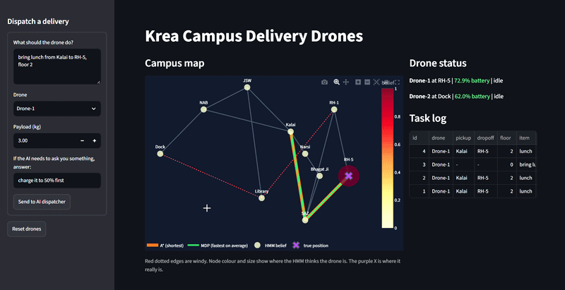
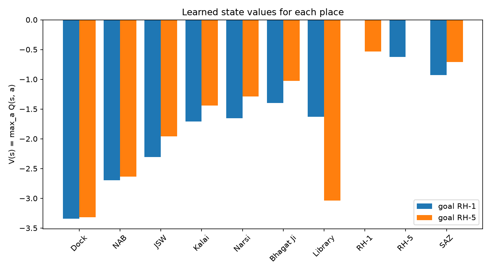

# Krea Campus Delivery Drones

COMP-343 Capstone, Track B
Ritanya

GitHub: https://github.com/ritanyamukund/KREA-Campus-drone
W&B project: https://wandb.ai/harsh_dixit-sias22-krea-university-top-university-for-li/krea-campus-drones

## What this project is

This is an agent that plans and checks drone deliveries around the Krea campus. Drones carry food from Kalai, Narsi and Bhagat Ji, and books from the Library, to RH-1 and RH-5. Each hall has one shared landing pad.

You type a delivery request into the dashboard. The LLM agent turns it into a plan, and a Z3 safety check confirms it before any drone "flies". If the plan is unsafe, the agent asks you what to change. For example, it can ask for a higher starting battery or for a heavy order to be split into two trips.

I started with a ground delivery bot. After the demo on 19 Sep, my professor suggested drones instead, because straight-line (Euclidean) distance makes more sense for something that flies. He also asked for travel times to be stochastic and modelled as an MDP, so that part was added too.

## Safety rules (checked with Z3)

1. Battery after the whole trip (start to pickup to dropoff) has to stay at 15% or more
2. Payload has to be 5 kg or less

Battery drain is 0.5% per 100 m.

## The six layers

| Layer | File | What it does |
|---|---|---|
| LLM agent | llm_interface.py | ReAct loop with 4 actions: find_path, verify_delivery, ask_user, finish |
| Safety check | safety_verifier.py | Z3 checks the battery and payload rules and returns SAT or UNSAT with feedback |
| Search / planning | campus_graph.py | Campus map (10 nodes, 14 edges) and A* shortest path |
| Perception | perception.py, hmm_filter.py | HMM tracks where the drone probably is using noisy GPS readings |
| MDP / RL | drone_mdp.py | Windy edges can fail, so Q-learning finds a safer route than A* |
| Adversarial search | conflict_resolver.py | Minimax decides which drone lands first when two arrive at the same pad |

Other files:

- memory_db.py stores the drones, their battery levels and tasks in SQLite. The database (campus_drone.db) is created automatically the first time you run the dashboard. Drone-1 starts at 85% and Drone-2 at 62%.
- dashboard.py is the Streamlit app that ties everything together.
- qlearning_lab.py, rl_utils.py and packbot_env.py are copied unchanged from my Q-learning lab. drone_mdp.py imports from them.
- wandb_log.py trains the drone Q-learning for both halls and logs the learning curves and state values to W&B. It's adapted from compare_policies.py in my Q-learning lab.
- learning_curves.png and state_values.png are the plots made by wandb_log.py.
- trace_default.json, trace_low_battery.json and trace_heavy.json are the saved agent traces from my test runs.

## Where the code came from

Most of the code is adapted from my earlier labs:

- Lab/agent.py became llm_interface.py
- Lab/verifier.py became safety_verifier.py
- Lab1 planner.py became campus_graph.py
- Lab2 hmm_filter.py is copied unchanged
- The Q-learning lab became drone_mdp.py. qlearning_update and linear_epsilon_schedule are imported unchanged. epsilon_greedy and init_Q are copied from rl_utils.py, and the only change is that drone states are already plain numbers.
- Q learning/compare_policies.py became wandb_log.py
- There was no lab for minimax, so I wrote conflict_resolver.py from the Class 3 adversarial search slides

## How it works (one run on the dashboard)

1. Fill in the dispatch form in the sidebar (pickup, dropoff, payload, battery)
2. The LLM agent plans the trip, and Z3 checks it. If the check fails, the agent asks you what to change.
3. The A* route and the MDP route are shown side by side. The MDP route avoids the windy edges (Dock-Library and Library-RH-1).
4. A simulated flight runs with wind. The HMM belief is shown as a heatmap, and you can step through it with a slider.
5. If both drones reach RH-1 or RH-5 together, minimax picks the landing order. Usually the drone with less battery lands first.
6. The database is updated with the new battery level and task status

## Setup

You need Python 3.10 or newer.

1. Clone the repo and go into the folder:
   git clone https://github.com/ritanyamukund/KREA-Campus-drone.git
   Then open the folder that git creates.

2. Install the packages:
   pip install -r requirements.txt

3. Set up your OpenAI API key:
   - Copy .env.example and rename the copy to .env
   - Open .env and paste your own key after OPENAI_API_KEY=
   - The code reads the key from this file using python-dotenv. The .env file is in .gitignore, so it never gets uploaded. There is no key anywhere in this repo.

4. Run the dashboard:
   streamlit run dashboard.py

The model used is gpt-5-mini.

## Tests and evaluation

The three agent test cases are run from the terminal:

    python llm_interface.py default
    python llm_interface.py low_battery
    python llm_interface.py heavy

- default: 80% battery and 1 kg. The plan is safe on the first try (SAT).
- low_battery: 18% battery. It would end at 14.58%, so it's UNSAT. The agent asks you, and if you answer something like "charge it to 50% first", it checks again and gets SAT.
- heavy: 7 kg is UNSAT. The agent asks you, and if you answer something like "split into 5kg and 2kg", both trips are SAT.

The last two need you to type an answer in the terminal when the agent asks. Each run saves a trace_<case>.json file.

Each layer can also be tested on its own:

    python safety_verifier.py     # three Z3 checks: one SAT, two UNSAT
    python perception.py          # HMM tracking a short flight with noisy GPS
    python drone_mdp.py           # learned values per place, and A* route vs MDP route to RH-5
    python conflict_resolver.py   # minimax landing order for two drones
    python wandb_log.py           # trains Q-learning for RH-1 and RH-5 and logs to W&B

## W&B results

The W&B project has the learning curves for both halls and the learned state values V(s) for each place on campus.

Places next to the windy edges get lower values, which is why the MDP route goes around them while A* goes straight through.

## Limitations

- Everything is simulated. The flights, the wind and the GPS noise are made up, and the wind failure chances (0.5 on windy edges, 0.1 elsewhere) are my own guesses, not measured.
- Edge lengths are straight-line distances on my own campus map scaled by 100, not real measured distances.
- The battery model is very simple. Drain only depends on distance, so payload weight doesn't use up more battery.
- The landing pad conflict is a test scenario. The other drone is assumed to arrive at the same pad at the same time with its current battery.
- gpt-5-mini doesn't give the same answer every time, so the agent may word its questions differently or take a different number of steps on the same request. It gets 12 steps at most. If it runs out, it saves trace_timeout.json so you can see what happened.
- The database is a single local SQLite file with no logins, so it's only meant for one person running the demo.

## Safety considerations

- The LLM never decides on its own that a trip is safe. It has to send the plan to the Z3 verifier, and it's told it can only finish after the verifier says SAT for that exact plan.
- If a plan fails, the agent isn't allowed to resend the same plan. It has to read the verifier's feedback and either change the plan or ask the user.
- If something that affects safety is missing, like where the drone is starting from, the agent asks instead of guessing. A wrong guess could make the verifier check the wrong trip.
- Z3 only checks the plan the LLM sends it. If the LLM misreads the request (for example, the wrong pickup place), Z3 would check the wrong trip. This is why the dashboard shows the agent's steps, so the user can catch it.
- The API key is only read from a local .env file, which is never uploaded.